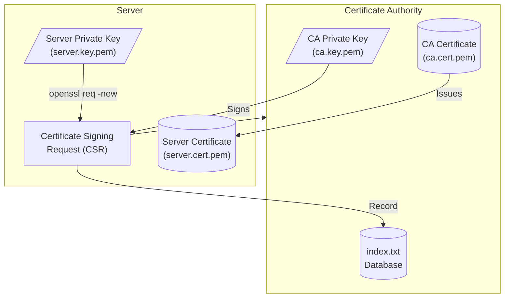
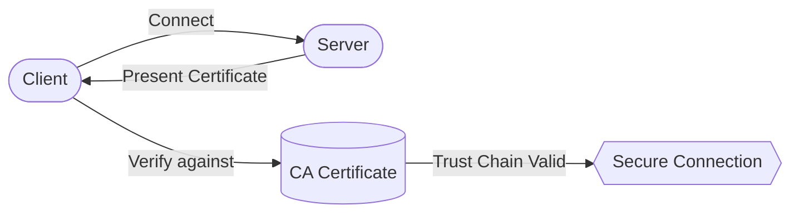
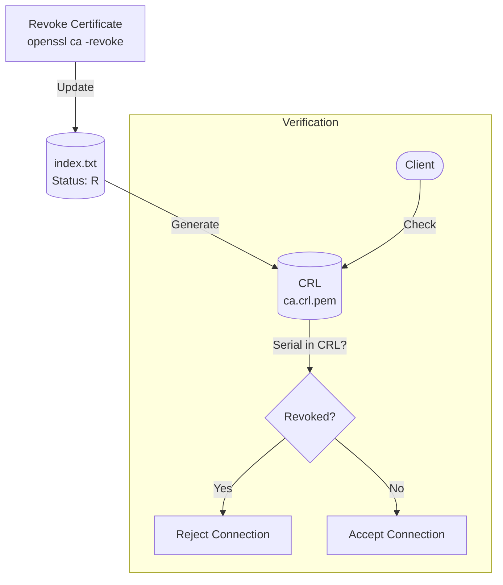
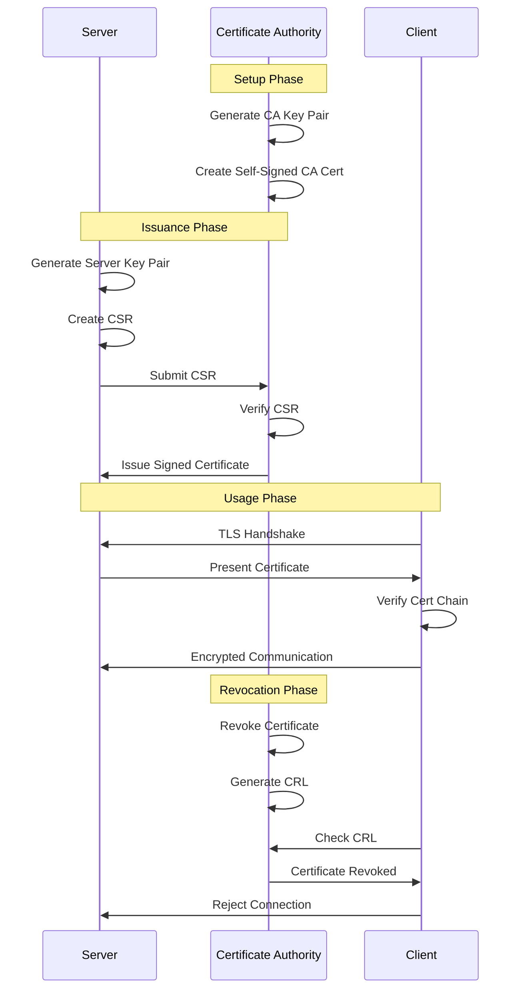

# PKI Process Diagram

## Certificate Issuance Flow



## Certificate Verification



## Certificate Revocation



## Complete PKI Lifecycle



## ASCII Diagram (for terminals)

```
┌─────────────────────────────────────────────────────────────────┐
│                    PKI CERTIFICATE LIFECYCLE                     │
└─────────────────────────────────────────────────────────────────┘

1. CA SETUP
   ┌──────────────────┐
   │  Root CA         │
   │  ┌────────────┐  │
   │  │ Private Key│──┼──► Self-signed Certificate
   │  └────────────┘  │
   └──────────────────┘

2. CERTIFICATE ISSUANCE
   ┌──────────┐         ┌──────────┐         ┌──────────┐
   │  Server  │──CSR───►│    CA    │──Cert──►│  Server  │
   │  Key     │         │  Signs   │         │  Cert    │
   └──────────┘         └──────────┘         └──────────┘

3. TLS CONNECTION
   ┌──────────┐                              ┌──────────┐
   │  Client  │◄─────── Certificate ────────│  Server  │
   │          │                              │          │
   │ Verify   │                              │          │
   │ against  │                              │          │
   │ CA Cert  │◄──────── Encrypted ────────►│          │
   └──────────┘                              └──────────┘

4. REVOCATION
   ┌──────────┐         ┌──────────┐         ┌──────────┐
   │    CA    │──Rev───►│   CRL    │◄──Check─│  Client  │
   │          │         │          │         │          │
   └──────────┘         └──────────┘         └──────────┘
                              │
                              ▼
                        ┌──────────┐
                        │ REJECTED │
                        └──────────┘
```
